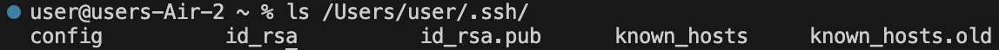

# Lab Report 2
Patrick Fong\
A14080869

## Part 1
Code for ChatServer.java:
```
import java.io.IOException;
import java.net.URI;
import java.util.ArrayList;

class Handler implements URLHandler {
    
    ArrayList<String> messages = new ArrayList<String>();

    public String handleRequest(URI url) {
        if (url.getPath().equals("/add-message")) {
            String[] parameters = url.getQuery().split("=");
            String[] messageString = parameters[1].split("&");
            String message = messageString[0];
            messages.add(parameters[2] + ": " + message + "\n");
            String output = "";
            for (String s : messages) {
                output += s;
            }
            return output;
        } else { return "404 Not Found!"; }
    }
}

class ChatServer {
    public static void main(String[] args) throws IOException {
        if(args.length == 0){
            System.out.println("Missing port number! Try any number between 1024 to 49151");
            return;
        }

        int port = Integer.parseInt(args[0]);

        Server.start(port, new Handler());
    }
}
```
**First screenshot, showing use of `/add-message?s=message 2&user=user 2`**\

* **Which methods in your code are called?**
> The `handleRequest(URI url)` method of the `Handler` class is called. The `Handler` class has a field `messages`, an ArrayList of Strings, which keeps track of all messages sent.
* **What are the relevant arguments to those methods, and the values of any relevant fields of the class?**
> The argument passed to `handleRequest(URI url)` is the url `http://localhost:2000/add-message?s=message 2&user=user 2`. Before the method is called, `messages` has only one element: `User 1: Message 1\n`.
* **How do the values of any relevant fields of the class change from this specific request? If no values got changed, explain why.**
> As a result of this request, a second element is added to the field `messages`: `user 2: message 2\n`.

**Second screenshot, showing use of `/add-message?s=mEsSaGE thReE&user=UsEr 3`**\

* **Which methods in your code are called?**
> The `handleRequest(URI url)` method of the `Handler` class is called. The `Handler` class has a field `messages`, an ArrayList of Strings, which keeps track of all messages sent.
* **What are the relevant arguments to those methods, and the values of any relevant fields of the class?**
> The argument passed to `handleRequest(URI url)` is the url `http://localhost:2000/add-message?s=mEsSaGE thReE&user=UsEr 3`. Before the method is called, `messages` has two elements: `User 1: Message 1\n` and `user 2: message 2\n`.
* **How do the values of any relevant fields of the class change from this specific request? If no values got changed, explain why.**
> As a result of this request, a third element is added to the field `messages`: `UsEr 3: mEsSaGE thReE\n`.


## Part 2
Screenshot 1: On the command line for my computer, I ran `ls` with the absolute path to the private key for my SSH key for logging into `ieng6`.\
\
Screenshot 2: On the command line for the ieng6 machine, I ran `ls` with the absolute path to the public key for my SSH key for logging into `ieng6`.\
\
Screenshot 3: A terminal interaction where I logged into my `ieng6` account without being asked for a password.\


## Part 3
I never knew how servers worked, so learning the basic mechanisms behind servers has been really interesting. Also, I've never worked with SSH keys. Likewise, learning about the basics of SSH keys has been great.
