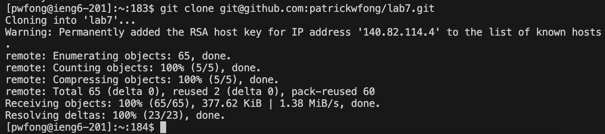
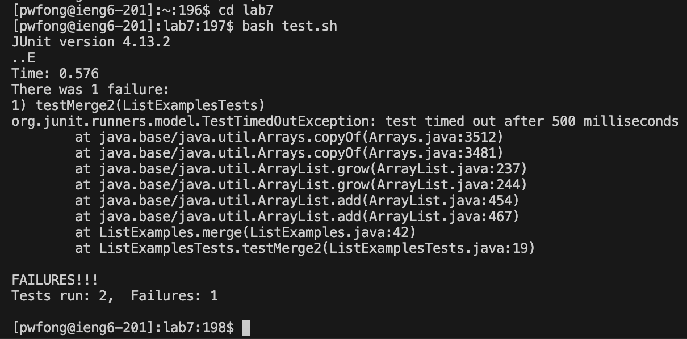
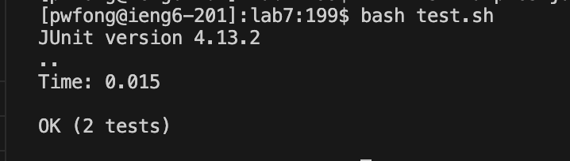
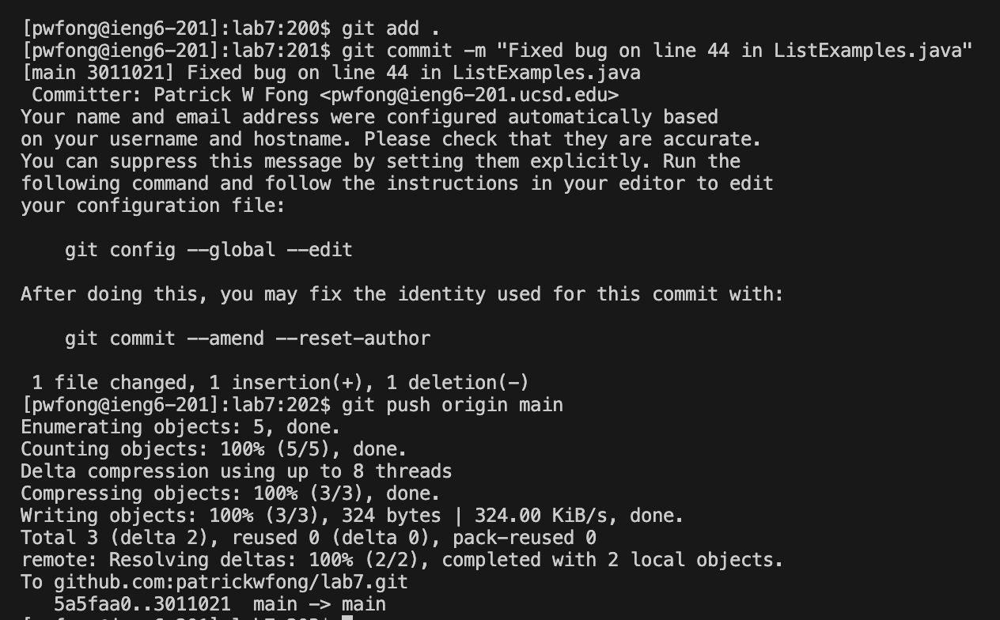
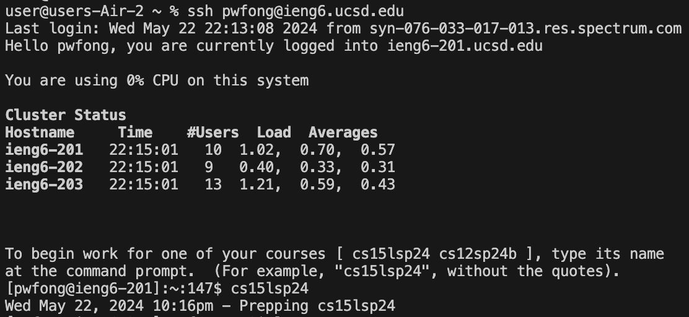

## Lab Report 4
Patrick Fong, A14080869\

Step 4:\
Screenshot: \
Key presses: opened terminal, typed ``ssh pwfong@ieng6.ucsd.edu``, pressed ``<enter>``. Typed ``cs15lsp24`` and ``<enter>`` when prompted.\
Summary of commands:\
Logged into ieng6\

Step 5:\
Screenshot: \
Key presses: ``git clone git@github.com:patrickwfong/lab7.git``, ``<enter>``\
Summary of commands: Cloned my fork of the repository\\

Step 6:\
Screenshot: \
Key presses:``cd lab7``, ``<enter>``, ``bash test.sh``, ``<enter>``\
Summary of commands: Changed working directory to the cloned directory, ran the shell script to run the tests.\\

Step 7:\
Screenshot: \
Key presses and explanation:\
``vim ListExamples.java``, ``<enter>`` to open the file to be edited\
``<enter>``, ``44``,``<enter>``, ``<right>``x5 to navigate to the error\
``r``to enter replace mode, ``2`` to fix the error, ``<esc>`` to exit replace mode\
``:wq``, ``<enter>`` to save and close the file\\

Step 8:\
Screenshot: \
Key presses and explanation: ``<up>``, ``<up>``, ``<enter>``: The ``bash test.sh`` command was only two up in search history, so I used the arrow to access it.

Step 9:\
Screenshot:\
Key presses and explanation:\
``git add .``: Add all files in the working directory to the staging area\
``git commit -m "Fixed bug on line 44 in ListExamples.java"``: Commit changes\
``git push origin main``: Push changes
