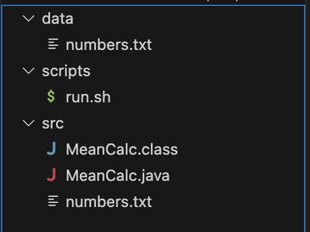
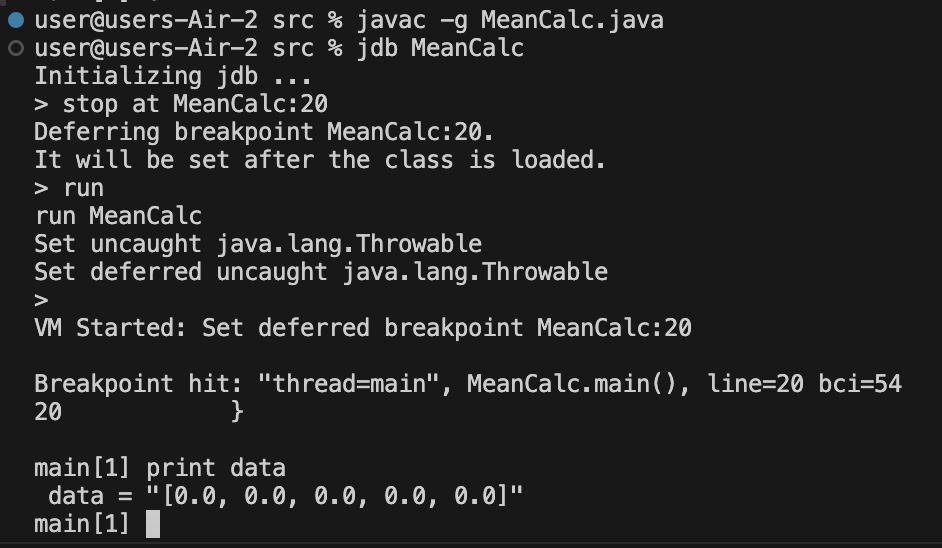
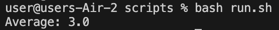

## Lab Report 5
Patrick Fong, A14080869\

# Part 1: Debugging Scenario
**Original student post with a screenshot showing a symptom and a guess as to what the bug might be:**\
\
&emsp; I'm trying to write a Java program that reads a list of numbers from a text file, then calculates and outputs the mean of the numbers.\
&emsp; The Java file is called ```MeanCalc.java```. The text file to be read is in a different directory called ```data```.\
&emsp; However, the program only outputs “Average: 0.0” regardless of what is written in the text file that provides the input.\
\
&emsp; Here is a screenshot of the directory structure:\
&emsp; \
&emsp; Here is the code in ```labfive/src/MeanCalc.java```:
```
import java.io.*;
import java.util.*;

public class MeanCalc {
    public static void main(String[] args) {

        BufferedReader reader;
        ArrayList<Double> data = new ArrayList<>();


        try {
            reader = new BufferedReader(new FileReader("../data/numbers.txt"));
            String currentLine = reader.readLine();
            while (currentLine != null) {
                data.add(Double.parseDouble(currentLine));
                currentLine = reader.readLine();
            }
        } catch (IOException e) {
            e.printStackTrace();
        }

        double sum = 0;

        for(double d : data) {
            sum += d;
        }

        System.out.println("Average: " + sum/data.size());
    }
}
```
&emsp; Here is the code in ```labfive/scripts/run.sh```:
```
cd ../src
javac MeanCalc.java
java MeanCalc
```
&emsp; Here are the contents of ```labfive/data/numbers.txt```:
```
1
2
3
4
5
```
&emsp; Here is a screenshot of the failure-inducing input and symptom:\
&emsp; \
\
&emsp; The output should be ```Average: 3.0```.\
&emsp; I'm not sure whether my program is calculating the average incorrectly or reading input from the wrong file. Any ideas?\
\
\
**A reponse from a TA asking a leading question or suggesting a command to try (To be clear, I'm mimicking a TA here):**\
\
&emsp; Are you sure the main method in MeanCalc.java is reading input from the correct file?\
&emsp; Using JDB, can you think of a way to check the value assigned to a field at a given line to determine the input is being correctly read?\
&emsp; What are the values in the numbers.txt file in the src directory?\
\
\
**A screenshot / terminal output showing what information the student got from trying that, and a clear description of what the bug is:**\
\
&emsp; \
&emsp; Thanks for the tip!\
&emsp; Using JDB to stop the process at line 20, the values that have been read and stored in the ```data``` ArrayList are: ```0, 0, 0, 0, 0```\
&emsp; These are the same values in the ```numbers.txt``` file in the ```src``` directory.\
&emsp; Apparently, this is the issue:\
&emsp; the program is reading input from the ```numbers.txt``` file in the ```src``` directory, rather than the ```data``` directory.\
\
\
**All the information needed about the setup, including-**\
\
**-the file and directory structure needed:**\
&emsp; \
\
**-the contents of each file before fixing the bug:**\
&emsp; Here is the code in ```labfive/src/MeanCalc.java```:
```
import java.io.*;
import java.util.*;

public class MeanCalc {
    public static void main(String[] args) {

        BufferedReader reader;
        ArrayList<Double> data = new ArrayList<>();


        try {
            reader = new BufferedReader(new FileReader("../data/numbers.txt"));
            String currentLine = reader.readLine();
            while (currentLine != null) {
                data.add(Double.parseDouble(currentLine));
                currentLine = reader.readLine();
            }
        } catch (IOException e) {
            e.printStackTrace();
        }

        double sum = 0;

        for(double d : data) {
            sum += d;
        }

        System.out.println("Average: " + sum/data.size());
    }
}
```
&emsp; Here is the code in ```labfive/scripts/run.sh```:
```
cd ../src
javac MeanCalc.java
java MeanCalc
```
&emsp; Here are the contents of ```labfive/data/numbers.txt```:
```
1
2
3
4
5
```
\
**-the full command line(s) used to trigger the bug:**\
&emsp; \
\
**-a description of what to edit to fix the bug:**\
&emsp; The program is reading input from the numbers.txt file in the src directory. The fix is to read input from the correct file.\
&emsp; So, to fix the bug, I should change line 12 from:\
&emsp; &emsp; &emsp; &emsp; &emsp; ```reader = new BufferedReader(new FileReader("numbers.txt"));```\
&emsp; to:\
&emsp; &emsp; &emsp; &emsp; &emsp; ```reader = new BufferedReader(new FileReader("../data/numbers.txt"));```\
&emsp; All good now!\
&emsp; \
\
\
# Part 2: Reflection
\
Before this quarter, I had barely used the terminal before and I had no experience with bash. I also hadn’t ever used jdb to debug; being able to pause Java processes and run them line by line is a game changer for debugging.\
\
Also, this class taught me a plethora of useful bash commands such as grep, find, wc, and sort. I’m now able to manually navigate directories and modify files purely through terminal command lines. Perhaps more importantly, I now have a better sense of what goes on under the hood in computer programs as they navigate through directories.\
\
Additionally, collaboration with my peers and tutors in 15L has greatly contributed to my learning. Specifically, Week 10’s lab was really interesting as I got to hear about my tutors’ past research projects and work experience, as well as their current and future career aspirations.
